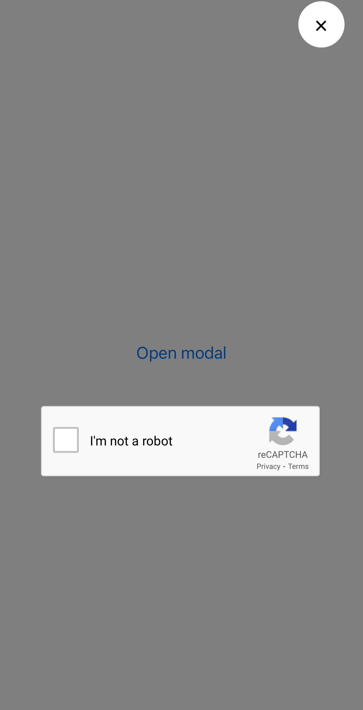
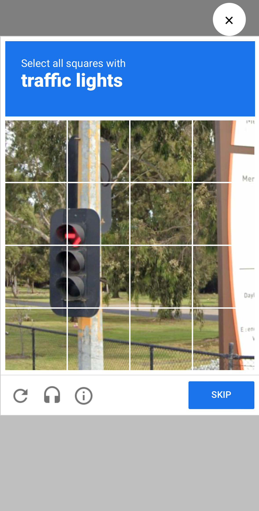

# Example Usage

The reCAPTCHA component is implemented in such a way that it stretches to the full available width and height by default. Users are expected to implement their own modal window for displaying the reCAPTCHA challenge.

## Implementation

To see an example implementation of how to use `react-native-google-recaptcha-provider`, you can refer to the `ModalExample.tsx`. This file demonstrates how to integrate the reCAPTCHA component within a modal window.

## Screenshots

